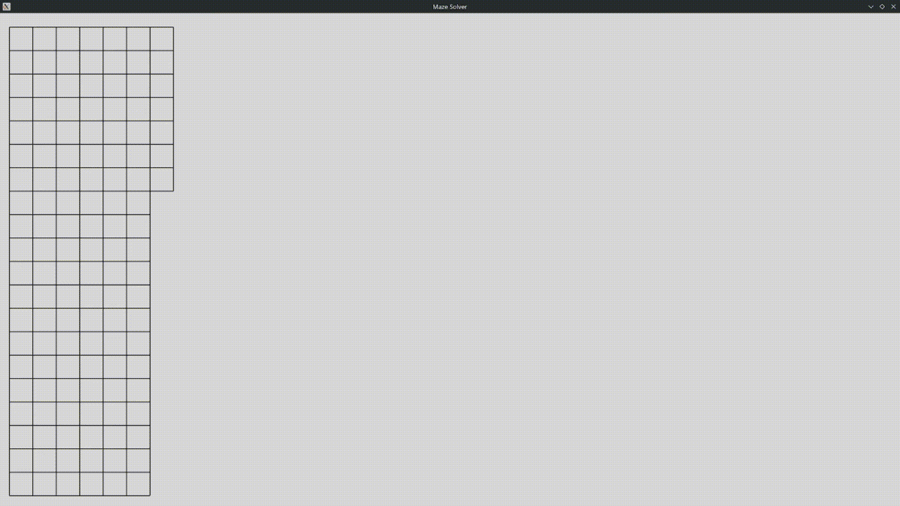

# Maze Solver

A Tkinter recursive maze generator and DFS solver, written in Python using the object-oriented programming paradigm.



## Usage

```bash
python main.py
```

## Tests

```bash
python -m unittest discover -s tests -v
```

## Roadmap
- [x] Basic Functioanlity
- [ ] BFS Alogrithm
- [ ] A* Search
